# Kidney Disease Knowledge Base - AI-Powered Semantic Search System

An intelligent document management and semantic search platform designed specifically for nephrology research and clinical documentation. This system leverages advanced machine learning techniques to enable healthcare professionals and researchers to efficiently navigate, analyze, and extract insights from kidney disease literature.

## Table of Contents

- [Problem Statement](#problem-statement)
- [Data Sources](#data-sources)
- [Architecture](#architecture)
- [Technology Stack](#technology-stack)
- [Features](#features)
- [System Requirements](#system-requirements)
- [Installation & Setup](#installation--setup)
- [Usage Guide](#usage-guide)
- [API Documentation](#api-documentation)
- [Project Structure](#project-structure)
- [License](#license)

---

## Problem Statement

Healthcare professionals and researchers face significant information overload in the field of nephrology. Thousands of articles, clinical guidelines, and studies on kidney diseases are scattered across multiple sources, making relevant information discovery extremely challenging and time-consuming.

### Key Challenges

**Fragmented Information**
- Medical literature is distributed across numerous platforms and databases
- Researchers spend excessive time locating relevant studies
- Critical information may be overlooked due to poor discoverability

**Inefficient Search Methods**
- Traditional keyword-based search engines require exact matches
- Semantic meaning and context are often lost
- Related concepts with different terminology are not connected

**Lack of Thematic Organization**
- Difficult to identify patterns across multiple research papers
- No clear visualization of research topic clusters
- Hard to discover emerging trends in nephrology

**Quality Control Issues**
- No automated detection of low-quality or anomalous documents
- Manual quality assessment is time-consuming and inconsistent
- Risk of including unreliable sources in research

**Limited Visualization**
- Relationships between studies are not easily apparent
- No intuitive way to explore the knowledge landscape
- Difficult to identify research gaps

### Our Solution

This Kidney Disease Knowledge Base addresses these challenges by implementing:
- Semantic search powered by transformer-based embeddings
- Automated document clustering for thematic organization
- Anomaly detection for quality control
- Interactive visualizations of document relationships
- Intelligent quality assessment system

---

## Data Sources

The system is designed to process and analyze medical literature from authoritative sources in nephrology:

**PubMed Central (PMC)**
- Peer-reviewed research articles on kidney diseases
- Clinical trials and systematic reviews
- Pathophysiology and treatment studies

**KDIGO Guidelines**
- Kidney Disease: Improving Global Outcomes international standards
- Evidence-based clinical practice guidelines
- Diagnosis and treatment protocols

**NIDDK (National Institute of Diabetes and Digestive and Kidney Diseases)**
- U.S. government research publications
- Evidence-based clinical information
- Patient education materials

**National Kidney Foundation**
- Patient education resources
- Prevention guidelines
- Disease management information

---

## Architecture

The system implements a clean, scalable architecture with clear separation of concerns:

### High-Level Architecture

```
┌─────────────────────────────────────────────────────────────────┐
│                         User Interface                          │
│                     (Angular Standalone)                        │
│                         Port: 4200                              │
└────────────────────────────┬────────────────────────────────────┘
                             │ REST API (HTTP/JSON)
                             ↓
┌─────────────────────────────────────────────────────────────────┐
│                      Backend API Layer                          │
│                     (FastAPI Framework)                         │
│                         Port: 8000                              │
├─────────────────────────────────────────────────────────────────┤
│  API Routes → Use Cases → Services → Domain Entities            │
└────────────┬──────────────────────────────────┬─────────────────┘
             │                                  │
             ↓                                  ↓
┌─────────────────────────┐      ┌──────────────────────────────┐
│   Vector Database       │      │   File System Storage        │
│     (ChromaDB)          │      │   (Documents + Metadata)     │
│  Semantic Embeddings    │      │      JSON + PDF/TXT          │
└─────────────────────────┘      └──────────────────────────────┘
```

### Component Details

**User Interface Layer**
- Built with Angular 19 standalone components
- Responsive design using Tailwind CSS
- Real-time updates and interactive visualizations
- RESTful communication with backend

**API Layer**
- FastAPI endpoints for all operations
- Request validation using Pydantic models
- Automatic OpenAPI documentation
- CORS support for cross-origin requests

**Application Layer**
- Use cases implement business logic
- Orchestrates operations between services
- Handles error management and validation

**Services Layer**
- Document processing and text extraction
- Machine learning operations (embeddings, clustering)
- Quality assessment and anomaly detection
- Vector search implementation

**Domain Layer**
- Core business entities and value objects
- Document, Chunk, and Embedding models
- Domain logic and rules

**Infrastructure Layer**
- ChromaDB for vector storage and retrieval
- File system for document persistence
- Model management and caching

### Backend Architecture (4-Layer Design)

```
kidney-desease-server/
├── src/
│   ├── api/                    # API Layer
│   │   └── routes/             # REST endpoints
│   ├── application/            # Application Layer
│   │   └── use_cases/          # Business logic orchestration
│   ├── domain/                 # Domain Layer
│   │   └── entities/           # Core business models
│   └── infrastructure/         # Infrastructure Layer
│       ├── document/           # Text extraction services
│       ├── ml/                 # ML models and operations
│       └── persistence/        # Data storage
```

### Frontend Architecture (Feature-Based)

```
kidney-desease-client/
├── src/
│   └── app/
│       ├── core/               # Core functionality
│       │   ├── layout/         # App shell and navigation
│       │   └── services/       # API communication
│       └── features/           # Feature modules
│           ├── dashboard/      # System overview
│           ├── documents/      # Document management
│           ├── search/         # Semantic search
│           ├── clustering/     # Document clustering
│           ├── anomaly/        # Anomaly detection
│           ├── quality/        # Quality assessment
│           └── visualization/  # Data visualization
```

---

## Technology Stack

### Backend
- **Framework**: FastAPI 0.104+
- **Language**: Python 3.11+
- **ML Library**: Sentence-Transformers (all-MiniLM-L6-v2)
- **Vector Database**: ChromaDB 0.4+
- **Document Processing**: PyPDF2, python-docx
- **Clustering**: scikit-learn (K-Means, DBSCAN)
- **Anomaly Detection**: Isolation Forest
- **Dimensionality Reduction**: UMAP, t-SNE

### Frontend
- **Framework**: Angular 19
- **Language**: TypeScript 5.3+
- **Styling**: Tailwind CSS 4.1+
- **HTTP Client**: Angular HttpClient
- **Charts**: (Optional) Chart.js or D3.js for visualizations

### Infrastructure
- **Containerization**: Docker & Docker Compose
- **API Documentation**: OpenAPI/Swagger (auto-generated)

---

## Processing Pipeline

The system implements a sophisticated six-stage pipeline for document processing and embedding generation:

### Stage 1: Document Upload
**Input**: PDF, TXT, or DOCX file  
**Process**: 
- User uploads document through the web interface
- File validation (format, size, content type)
- Generates unique document ID
- Saves original file to file system

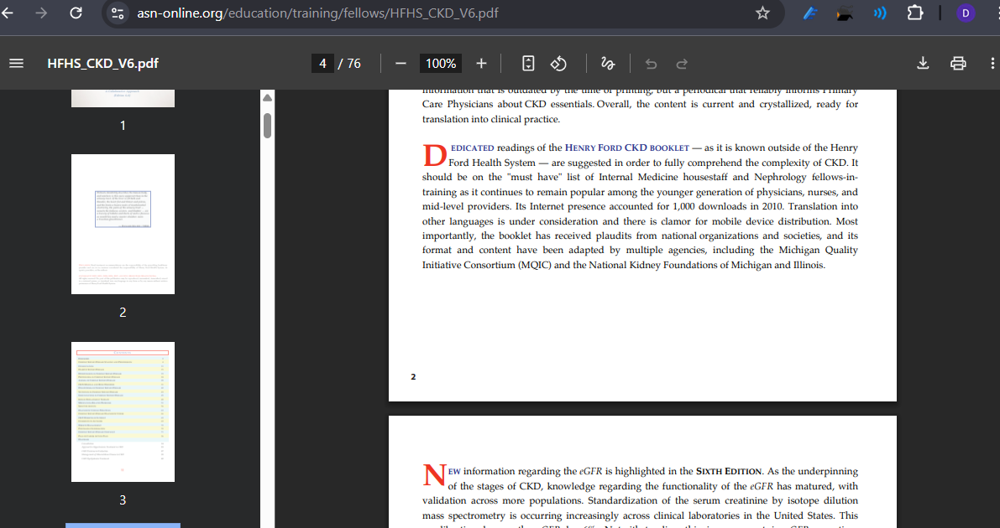


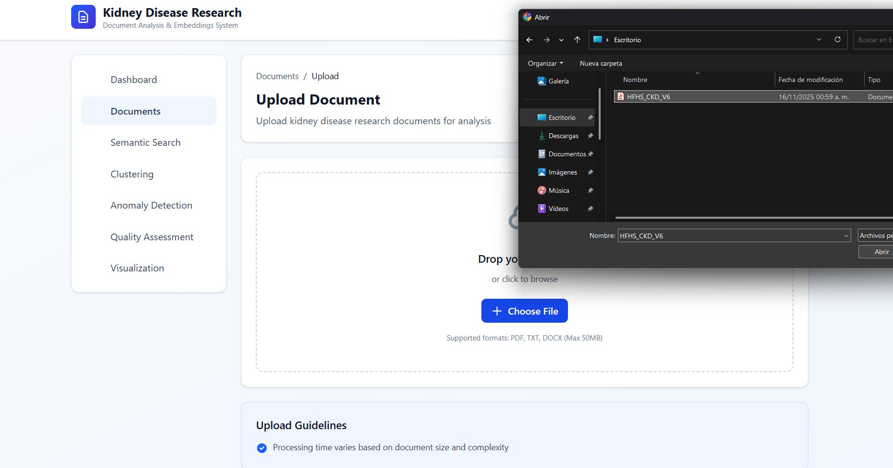

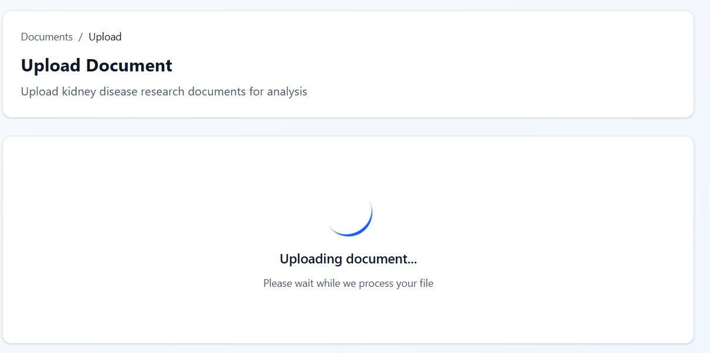


### Stage 2: Text Extraction
**Libraries Used**: 
- PyPDF2 for PDF documents
- python-docx for DOCX files
- Direct reading for TXT files

**Process**:
- Extracts raw text content from uploaded file
- Preserves document structure where possible
- Handles multi-page documents
- Error handling for corrupted files

### Stage 3: Text Cleaning & Normalization
**Process**:
- Removes null characters and special symbols
- Normalizes whitespace (multiple spaces → single space)
- Strips leading/trailing whitespace
- Converts to UTF-8 encoding
- Removes formatting artifacts

**Before**: `"Kidney\x00  disease   affects\n\nmillions..."`  
**After**: `"Kidney disease affects millions..."`

### Stage 4: Intelligent Chunking
**Strategy**: Sliding window with overlap

**Configuration**:
- **Chunk size**: 512 characters
- **Overlap**: 50 characters
- **Rationale**: Maintains context between chunks

**Example**:
```
Original text: "Chronic kidney disease (CKD) is a progressive condition..."

Chunk 1: "Chronic kidney disease (CKD) is a progressive condition..."
Chunk 2: "...condition characterized by gradual loss of kidney function..."
         ↑
      50-char overlap maintains context
```

**Benefits**:
- Prevents loss of semantic meaning at boundaries
- Enables better embedding quality
- Improves search accuracy

### Stage 5: Embedding Generation
**Model**: all-MiniLM-L6-v2 (Sentence-Transformers)

**Specifications**:
- **Output dimension**: 384
- **Max sequence length**: 256 tokens
- **Average inference time**: ~5ms per chunk
- **Model size**: 80MB

**Process**:
1. Tokenize text chunk
2. Pass through transformer model
3. Apply mean pooling on token embeddings
4. Normalize to unit vector
5. Generate 384-dimensional embedding

**Why this model?**
- Excellent balance between speed and quality
- Optimized for semantic similarity tasks
- Multilingual capabilities
- Small footprint for efficient deployment

### Stage 6: Vector Storage
**Database**: ChromaDB

**Storage Process**:
- Embeddings stored with metadata
- Document ID, chunk index, original text
- Automatic indexing for fast retrieval

**Retrieval Method**: Cosine similarity
```
similarity = (query_vector · document_vector) / (||query|| × ||document||)
```

**Performance**:
- Sub-second search on 100K+ documents
- Approximate nearest neighbor search
- Automatic persistence to disk

---

## Features

### 1. Dashboard

A comprehensive overview of the entire knowledge base with real-time statistics and system health monitoring.

**Key Metrics:**
- Total documents in the system
- Total text chunks processed
- Average chunks per document
- Processing status breakdown

**Visualizations:**
- Status distribution (completed, processing, pending, failed)
- Document type distribution
- Upload trends over time

**Use Case:**  
Quickly assess system capacity and processing status. Monitor document ingestion pipeline health.

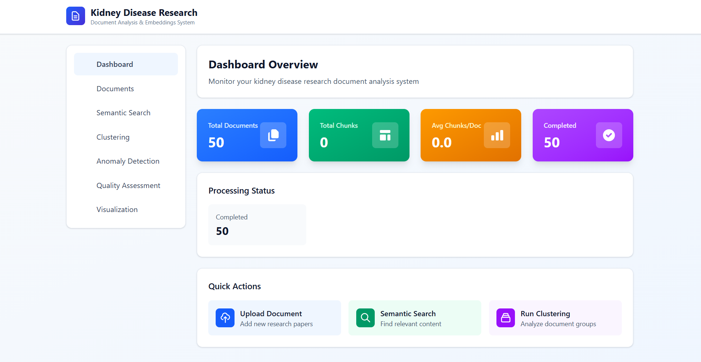

---

### 2. Document Management

Complete CRUD operations for medical documents with status tracking.

**Features:**

**Document Upload**
- Drag-and-drop interface
- Support for PDF, TXT, DOCX formats
- Real-time upload progress
- Automatic processing trigger

**Document List**
- Sortable table view
- Filter by status, type, date
- Search by filename
- Batch operations support

**Document Details**
- Metadata viewing
- Processing status
- Chunk count
- Error logs (if failed)

**Document Deletion**
- Confirmation dialog
- Cascade deletion of embeddings
- Audit trail

**Use Case:**  
Healthcare administrators can organize clinical guidelines, researchers can manage literature reviews, and clinicians can maintain reference materials.

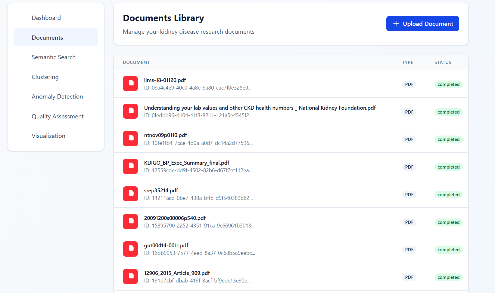


---

### 3. Semantic Search

Advanced semantic search that understands context and medical terminology, going beyond simple keyword matching.

**How It Works:**
1. User enters natural language query
2. Query is converted to 384-dim embedding
3. Cosine similarity computed against all chunks
4. Top-K most relevant results returned
5. Results ranked by similarity score

**Features:**
- Natural language queries
- Configurable result count (top-K)
- Document filtering options
- Highlighted relevant passages
- Similarity score display
- Related documents suggestions

**Search Types:**
- **Conceptual**: "what causes kidney failure"
- **Symptom-based**: "signs of declining renal function"
- **Treatment-focused**: "management of stage 3 CKD"

**Example Queries:**
```
"diabetic nephropathy risk factors"
→ Returns: Studies on diabetes-related kidney damage, 
risk assessment, prevention strategies

"treatment options for end-stage renal disease"
→ Returns: Dialysis procedures, transplant protocols, 
palliative care guidelines
```

**Why Semantic Search?**
- Finds conceptually similar content
- Understands medical synonyms (CKD = chronic kidney disease)
- Works with incomplete or colloquial queries
- No need for exact terminology

**Use Case:**  
Clinicians can quickly find treatment protocols, researchers can discover related studies, and students can explore topics without knowing exact medical terms.


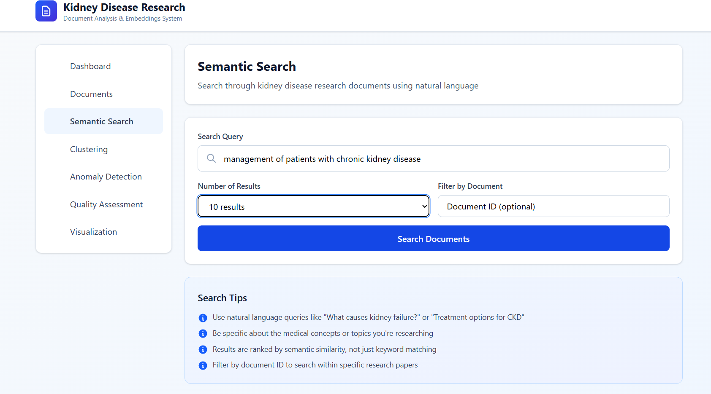

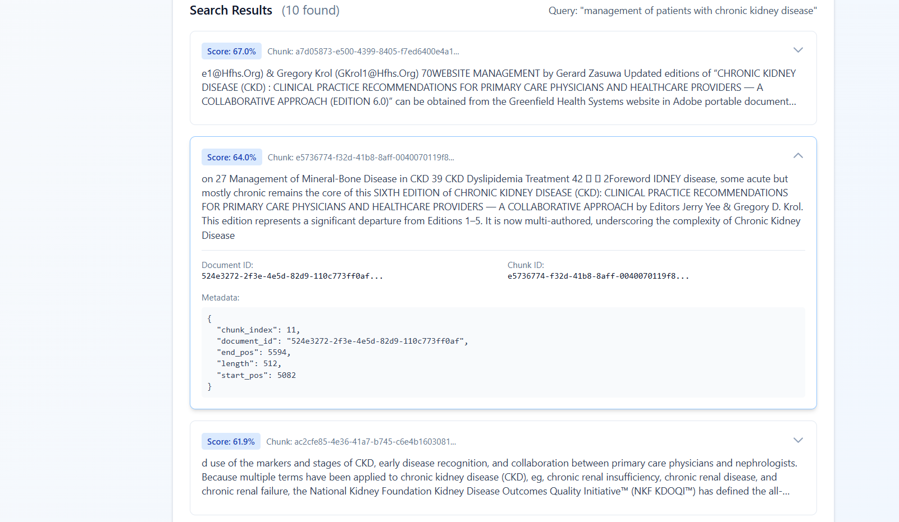
---

### 4. Document Clustering

Automatic thematic organization using unsupervised machine learning to discover hidden patterns in the document collection.

**Algorithm**: K-Means Clustering

**Process:**
1. Aggregate all document embeddings
2. Apply K-Means algorithm
3. Identify cluster centroids
4. Assign documents to nearest cluster
5. Extract top terms per cluster
6. Select representative documents

**Configuration:**
- Number of clusters: 2-20 (user-configurable)
- Default: 5 clusters
- Distance metric: Euclidean distance

**Output:**
- Cluster ID and size
- Top 10 distinctive terms per cluster
- 3 representative document chunks
- Visualization of cluster distribution

**Use Case Examples:**

**Research Organization:**
- Cluster 1: "Prevention and early detection"
- Cluster 2: "Dialysis and transplantation"
- Cluster 3: "Pediatric kidney disease"
- Cluster 4: "Genetic factors"
- Cluster 5: "Nutrition and lifestyle"

**Benefits:**
- Discover research themes automatically
- Identify literature gaps
- Organize large document collections
- Find related studies across different terminology

**Use Case:**  
Literature review automation, research trend analysis, identifying underexplored areas in nephrology.

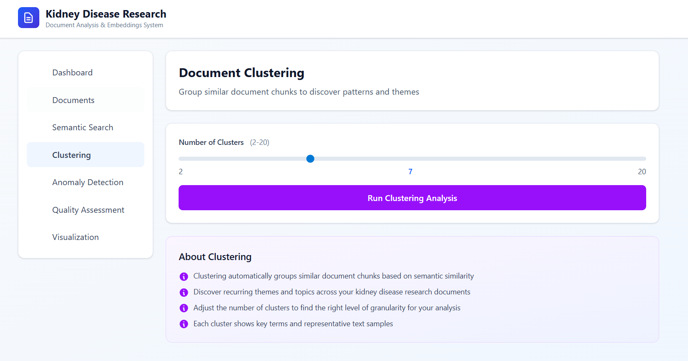

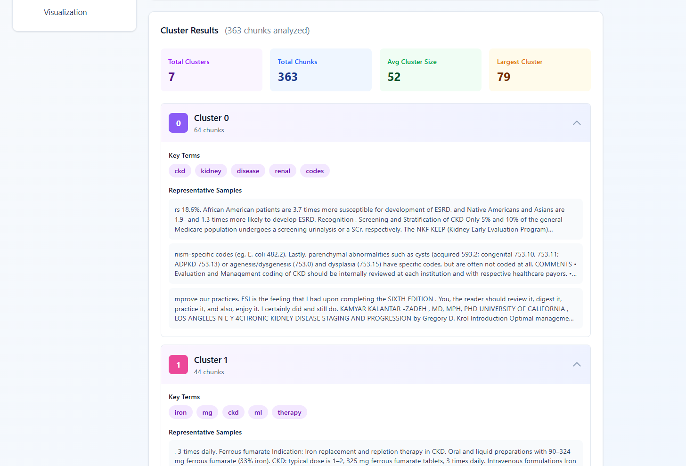
---

### 5. Anomaly Detection

Automated quality control system that identifies unusual, low-quality, or potentially erroneous documents.

**Algorithm**: Isolation Forest

**How It Works:**
1. Builds ensemble of isolation trees
2. Measures average path length to isolate each point
3. Anomalies require fewer splits (shorter paths)
4. Assigns anomaly score to each document

**Configuration:**
- Contamination rate: 1% - 50%
- Default: 10% (assumes 10% anomalies)

**Detection Criteria:**
- Statistical outliers in embedding space
- Unusually short or long documents
- Inconsistent formatting
- Low information density
- Potential data corruption

**Anomaly Types Detected:**

**Content-Based:**
- Duplicate or near-duplicate documents
- Placeholder text or lorem ipsum
- Machine-generated gibberish
- Incomplete extractions

**Structure-Based:**
- Severely truncated documents
- Encoding errors
- Corrupted PDFs
- Extraction failures

**Output:**
- Anomaly flag (true/false)
- Anomaly score (0-1, higher = more anomalous)
- Document metadata
- Suggested action (review, delete, reprocess)

**Use Case:**  
Quality assurance teams can identify problematic uploads, data curators can maintain collection integrity, and administrators can prevent low-quality content from polluting search results.

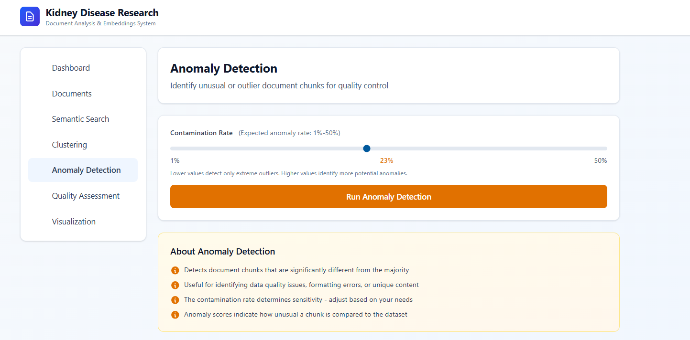

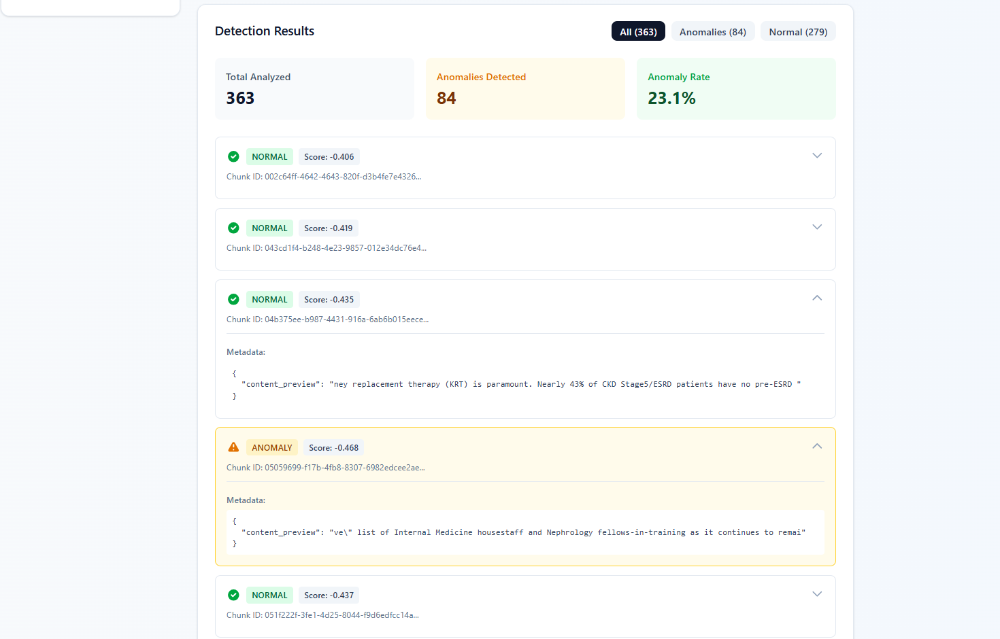

---

### 6. Quality Assessment

Machine learning-based quality classification system with human-in-the-loop training capability.

**Classification Categories:**
- **High**: Peer-reviewed research, clinical guidelines
- **Medium**: Educational materials, summaries
- **Low**: Incomplete documents, poor formatting
- **Anomalous**: Corrupted or irrelevant content

**Features:**

**Quality Prediction**
- Automatic quality scoring
- Confidence levels
- Feature importance display
- Batch processing support

**Quality Training**
- Upload labeled training data
- Model retraining interface
- Performance metrics display
- Cross-validation results

**Feature Engineering:**
The system extracts multiple features for quality assessment:
- Document length
- Vocabulary richness (unique words / total words)
- Average word length
- Sentence complexity
- Citation presence
- Formatting quality
- Metadata completeness

**Workflow:**

**Initial Training:**
1. Domain expert labels sample documents
2. System extracts features
3. Trains random forest classifier
4. Validates on held-out test set

**Continuous Improvement:**
1. Predict quality on new documents
2. Expert reviews predictions
3. Corrects misclassifications
4. Retrains model with new data

**Metrics Displayed:**
- Accuracy
- Precision, Recall, F1-score per class
- Confusion matrix
- Feature importance

**Use Case:**  
Maintain high-quality knowledge base, prioritize document review efforts, filter search results by quality, automate editorial workflows.

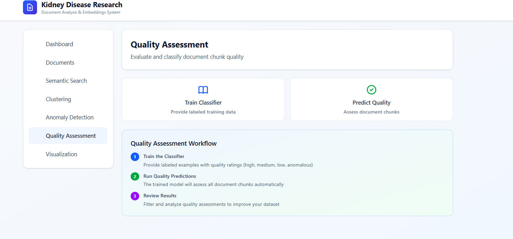

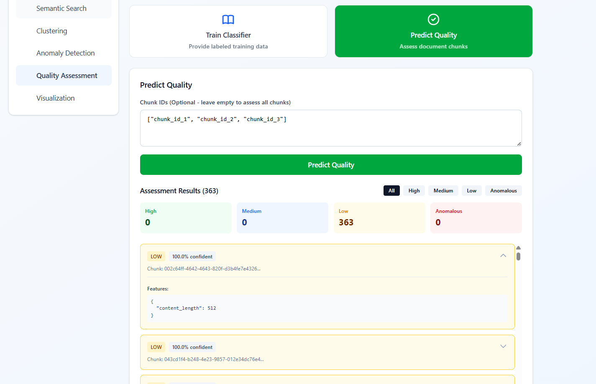

---

### 7. Interactive Visualization

2D embeddings visualization using dimensionality reduction techniques to explore document relationships spatially.

**Techniques:**
- **UMAP** (Uniform Manifold Approximation and Projection)
- **t-SNE** (t-Distributed Stochastic Neighbor Embedding)

**Features:**
- Interactive scatter plot
- Color-coded by cluster or quality
- Hover tooltips with document info
- Zoom and pan controls
- Document selection
- Export visualization

**Visualization Elements:**
- Each point = one document chunk
- Proximity = semantic similarity
- Clusters = thematic groups
- Outliers = anomalies or unique content

**Use Case:**  
Exploratory data analysis, identifying document relationships, discovering research clusters, presenting findings to stakeholders.


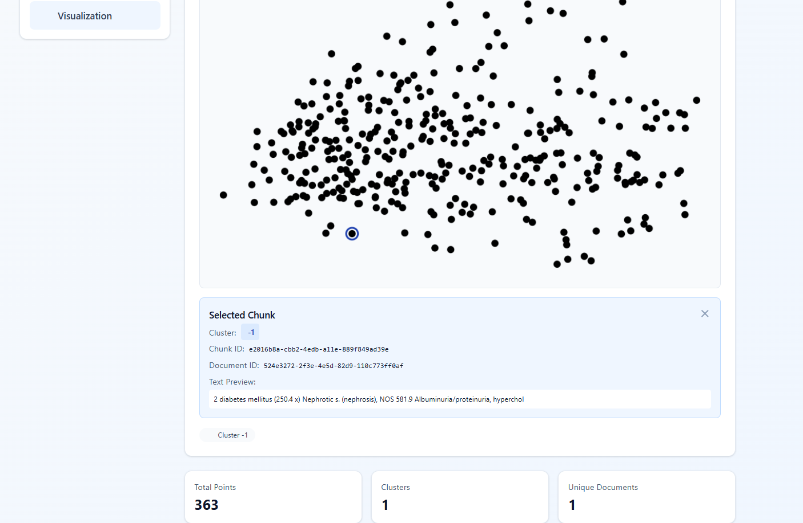

---

## System Requirements

### Minimum Requirements
- **CPU**: 2 cores, 2.0 GHz
- **RAM**: 4 GB
- **Storage**: 10 GB free space
- **OS**: Windows 10/11, macOS 10.15+, Ubuntu 20.04+

### Recommended Requirements
- **CPU**: 4 cores, 3.0 GHz
- **RAM**: 8 GB
- **Storage**: 20 GB SSD
- **OS**: Latest stable OS version

### For Production
- **CPU**: 8+ cores
- **RAM**: 16+ GB
- **Storage**: 50+ GB SSD
- **Network**: 100+ Mbps
- **GPU**: Optional, for faster embedding generation

### Software Dependencies
- **Docker**: 24.0+
- **Docker Compose**: 2.20+
- **Git**: 2.30+

---

## Installation & Setup

### Prerequisites

1. **Install Docker Desktop**
   - Download from: https://www.docker.com/products/docker-desktop
   - Ensure Docker Compose is included
   - Verify installation:
   ```bash
   docker --version
   docker-compose --version
   ```

2. **Install Git**
   - Download from: https://git-scm.com/downloads
   - Configure user:
   ```bash
   git config --global user.name "Your Name"
   git config --global user.email "your.email@example.com"
   ```

### Clone Repository

```bash
git clonehttps://github.com/DaynorTito/AI-Documents-Semantic-Search.git
cd AI-Documents-Semantic-Search
```

### Project Structure Overview

```
AI-Documents-Semantic-Search/
├── kidney-desease-server/     # Python FastAPI backend
│   ├── data/                  # Data storage
│   │   ├── documents/         # Original uploaded files
│   │   ├── documents_db/      # ChromaDB vector storage
│   │   └── models/            # ML model cache
│   ├── src/                   # Source code
│   │   ├── api/               # API routes
│   │   ├── application/       # Business logic
│   │   ├── domain/            # Domain models
│   │   └── infrastructure/    # External services
│   ├── Dockerfile
│   └── requirements.txt
│
├── kidney-desease-client/     # Angular frontend
│   ├── src/
│   │   └── app/
│   │       ├── core/          # Core services
│   │       └── features/      # Feature modules
│   ├── Dockerfile
│   └── package.json
│
└── docker-compose.yml         # Docker orchestration
```

### Environment Configuration

Create `.env` file in the root directory:

```env
EMBEDDING_MODEL=sentence-transformers/all-MiniLM-L6-v2
CHROMA_PERSIST_DIR=./data/chroma_db
DOCUMENTS_DIR=./data/documents
CHUNK_SIZE=512
CHUNK_OVERLAP=50
MIN_QUALITY_SCORE=0.6
ANOMALY_CONTAMINATION=0.1
N_CLUSTERS=5
API_HOST=0.0.0.0
API_PORT=8000
LOG_LEVEL=INFO

```

### Launch Application

**Important**: The initial startup may take 5-15 minutes depending on your internet connection and system specifications. This is because:
- Docker images need to be downloaded (backend ~800MB, frontend ~600MB)
- Python dependencies need to be installed
- The embedding model (all-MiniLM-L6-v2) will be downloaded (~80MB)
- Node modules need to be installed (~300MB)

```bash
docker-compose up -d
```

**What happens during startup:**
1. Building Docker images (first time only)
2. Installing Python packages
3. Installing Node.js packages
4. Downloading ML model
5. Initializing ChromaDB
6. Starting backend server
7. Starting frontend server

**Monitor startup progress:**
```bash
docker-compose logs -f
```

**Check container status:**
```bash
docker-compose ps
```

Expected output:
```
NAME                    STATUS
kidney-backend          Up (healthy)
kidney-frontend         Up
```

### Verify Installation

**Backend API** (FastAPI):
```
http://localhost:8000
```

**API Documentation** (Swagger UI):
```
http://localhost:8000/docs
```
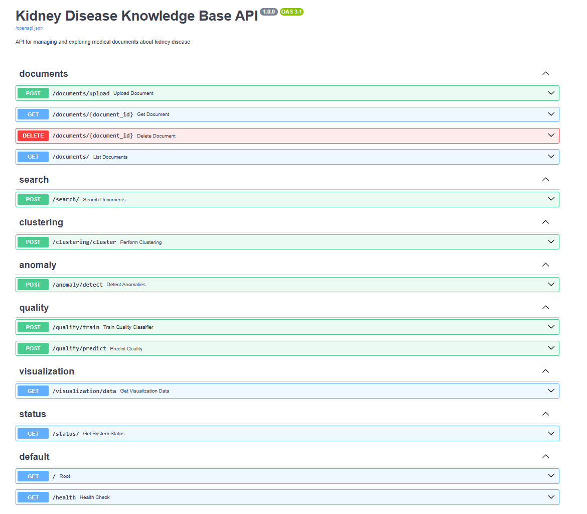

**Frontend Application** (Angular):
```
http://localhost:4200
```

### Health Check

```bash
curl http://localhost:8000/health
```

Expected response:
```json
{
  "status": "healthy",
  "timestamp": "2024-01-15T10:30:00Z"
}
```

### Stop Application

```bash
docker-compose down
```

To also remove volumes (data will be lost):
```bash
docker-compose down -v
```

---

## Usage Guide

### 1. Upload Your First Document

1. Navigate to **Documents** → **Upload**
2. Click "Choose File" or drag and drop
3. Select a PDF, TXT, or DOCX file (max 50MB)
4. Click "Upload Document"
5. Wait for processing to complete (status: pending → processing → completed)

**Processing Time Estimates:**
- Small file (< 1 MB): 5-10 seconds
- Medium file (1-10 MB): 10-30 seconds
- Large file (10-50 MB): 30-120 seconds

### 2. Perform Semantic Search

1. Navigate to **Semantic Search**
2. Enter your query (natural language)
   - Example: "risk factors for chronic kidney disease"
3. Adjust "Number of Results" (default: 10)
4. Optional: Filter by specific document
5. Click "Search"
6. Review results sorted by relevance

**Tips for Better Searches:**
- Use natural language questions
- Be specific but not overly technical
- Try variations if results aren't satisfactory
- Use medical terms and lay terms interchangeably

### 3. Discover Document Clusters

1. Navigate to **Clustering**
2. Select number of clusters (2-20, default: 5)
3. Click "Perform Clustering"
4. Wait for analysis (may take 10-30 seconds)
5. Explore clusters:
   - View top terms defining each cluster
   - Read representative documents
   - Identify thematic patterns

**Interpretation:**
- Larger clusters = broader topics
- Smaller clusters = niche or specific topics
- Overlapping terms = related themes

### 4. Run Anomaly Detection

1. Navigate to **Anomaly Detection**
2. Set contamination rate (expected % of anomalies, default: 10%)
3. Click "Detect Anomalies"
4. Review flagged documents
5. Investigate high anomaly scores
6. Take action: review, reprocess, or delete

**When to Use:**
- After bulk document uploads
- Periodic quality audits
- Before important searches
- When search quality seems poor

### 5. Assess Document Quality

1. Navigate to **Quality Assessment**

**To Train the Model:**
1. Prepare labeled training data (CSV or JSON)
   - Format: `[{chunk_id: "...", label: "high"}, ...]`
2. Click "Train Model"
3. Upload training file
4. Review metrics (accuracy, precision, recall)

**To Predict Quality:**
1. Click "Predict Quality"
2. Optional: Specify chunk IDs (otherwise predicts all)
3. Review quality classifications
4. Filter documents by quality level

### 6. Visualize Document Embeddings

1. Navigate to **Visualization**
2. Select dimensionality reduction method (UMAP or t-SNE)
3. Choose color coding (cluster, quality, document)
4. Wait for generation (10-60 seconds depending on dataset size)
5. Interact with visualization:
   - Hover for document details
   - Click to view full document
   - Zoom/pan to explore

---

## API Documentation

### Full API Documentation

The complete API documentation with interactive testing is available at:

```
http://localhost:8000/docs
```

**Features:**
- Complete endpoint descriptions
- Request/response schemas
- Interactive "Try it out" functionality
- Example requests and responses
- Authentication details


### Quick API Reference

**Base URL**: `http://localhost:8000`

#### Document Management

**Upload Document**
```http
POST /documents/upload
Content-Type: multipart/form-data

Form Data:
  file: <binary>
```

**List Documents**
```http
GET /documents/?skip=0&limit=100
```

**Get Document**
```http
GET /documents/{document_id}
```

**Delete Document**
```http
DELETE /documents/{document_id}
```

#### Search

**Semantic Search**
```http
POST /search/
Content-Type: application/json

{
  "query": "kidney disease symptoms",
  "top_k": 10,
  "filter_document_id": "optional-doc-id"
}
```

#### Clustering

**Perform Clustering**
```http
POST /clustering/cluster
Content-Type: application/json

{
  "n_clusters": 5
}
```

#### Anomaly Detection

**Detect Anomalies**
```http
POST /anomaly/detect
Content-Type: application/json

{
  "contamination": 0.1
}
```

#### Quality Assessment

**Train Quality Classifier**
```http
POST /quality/train
Content-Type: application/json

{
  "training_data": [
    {"chunk_id": "...", "label": "high"},
    {"chunk_id": "...", "label": "low"}
  ]
}
```

**Predict Quality**
```http
POST /quality/predict
Content-Type: application/json

["chunk-id-1", "chunk-id-2"]  // optional, null for all
```

#### Visualization

**Get Visualization Data**
```http
GET /visualization/data
```

#### System Status

**Get System Status**
```http
GET /status/
```

